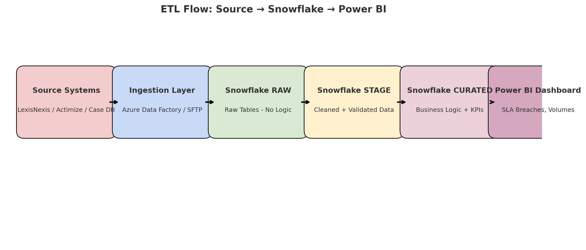

# 🧠 Compliance Case Monitoring Dashboard (Snowflake + Power BI)

This project demonstrates how a Senior Business Systems Analyst with data analysis expertise can lead the discovery, documentation, and delivery of a real-time compliance dashboard using **Snowflake** and **Power BI**.

---

## ✅ Project Goals

- Migrate legacy compliance case data into a governed Snowflake warehouse
- Design RAW → STAGE → CURATED schemas aligned with ETL best practices
- Build curated Snowflake views to support real-time Power BI dashboards
- Enable SLA tracking, analyst productivity insights, and audit traceability

---

## 📊 Architecture Diagram

### 🔹 Snowflake Schema Architecture

---

### 🔹 ETL Pipeline Flow

---

## 🧾 Project Phases

### 📋 Phase 1: Business Analysis

- Conducted stakeholder interviews across Compliance, QA, Risk teams
- Authored **BRD** and **FRD** with data dictionary, rules, and lineage
- Wrote Agile user stories and acceptance criteria
- Created Visio-based process flows and system diagrams

### 🧱 Phase 2: Data Design & Engineering

- Performed data profiling in Snowflake
- Defined schema architecture: RAW → STAGE → CURATED
- Created STTM (Source-to-Target Mapping)
- Built validated Snowflake views using SQL and business logic

### 📈 Phase 3: Dashboarding

- Connected Power BI via DirectQuery to CURATED views
- Designed visuals: SLA breach trends, case volumes, analyst workload
- Built DAX measures for SLA duration, thresholds, filters

---

## 🔎 Outcome

- Delivered a scalable, audit-ready compliance dashboard
- Enabled real-time SLA visibility for stakeholders
- Replaced Excel-based tracking with governed, automated insights

---

## 🛠️ Tech Stack

**Snowflake**, **Power BI**, **SQL**, **DAX**, **Azure Data Factory**, **Visio**, **JIRA**, **Confluence**

---

> 🗂️ Author: Senior Business Data Analyst  
> 📅 Created on: July 25, 2025
